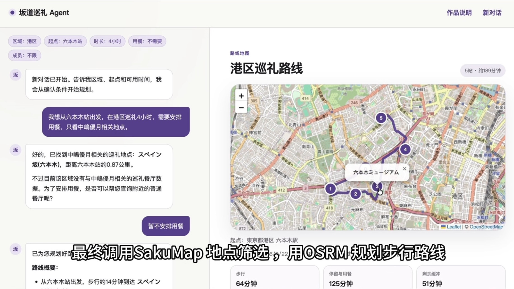
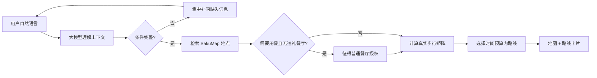

# 櫻坂圣地巡礼路线规划 Agent

> 面向中国櫻坂46粉丝的多轮路线规划产品：把“想在港区巡礼半天、从六本木站出发、只看某位成员相关地点”等自然语言需求，转化为可执行的地点组合、步行顺序和地图路线。

[在线限量 Demo](https://sakamichi-pilgrimage-agent.yuxinying941.chatgpt.site) ·[🎬 产品演示](https://youtu.be/pziU0P29Zjs)·[完整产品案例](docs/product-case-study.md) · [Agent 设计](docs/agent-design.md) · [评测报告](docs/evaluation.md)

## 产品介绍

现有圣地地图解决“地点在哪里”，却没有解决“我今天应该怎么走”。用户仍需在圣地地图、Google Maps 与餐厅页面之间反复切换，手动判断距离、时间和顺序。

本产品将这个过程压缩为一次对话：

1. 理解区域、起点、可用时长、用餐需求和成员偏好；
2. 缺少必要信息时集中补问，并在多轮对话中继承已确认条件；
3. 从限定数据源检索巡礼地点，优先安排巡礼餐厅；
4. 计算真实步行距离，选择在时间预算内更顺路的地点组合；
5. 用地图、时间卡片和地点卡片输出可执行方案。

## 演示

### 产品演示视频

### 产品演示视频

[](https://youtu.be/pziU0P29Zjs)

> 🎬 点击图片观看完整产品演示


### 核心流程 GIF


自然语言输入  
→ Agent 自动补问缺失条件  
→ 检索成员相关圣地  
→ 计算真实步行距离  
→ 在时间预算内生成可执行路线  
→ 地图可视化

## Agent 如何工作



Function Calling 工具包括：更新行程条件、解析起点、检索巡礼地点、记录普通餐厅授权、检索普通餐厅、规划步行路线。模型决定何时调用；后端负责参数校验、授权规则和数据边界。

## 结果与验证

- 430+ 条公开地点记录，本地快照与线上刷新双保险；
- 真实多轮上下文，可重新规划并清空旧条件；
- OpenStreetMap 地图与真实步行线路；
- 覆盖条件抽取、成员筛选、错误地名、空结果、Markdown 卡片与补问状态的自动回归；
- 公共 Demo 使用 D1 持久化限额，API Key 仅存在服务端环境变量。

更详细的用户问题、MVP 范围、指标与取舍见 [产品案例](docs/product-case-study.md)，核心测试见 [评测报告](docs/evaluation.md)。

## 关键决策

| 产品问题 | 决策 | 原因 |
| --- | --- | --- |
| Agent 要做多大 | 聚焦“一次巡礼路线规划” | 完整闭环比堆叠无关功能更能验证价值 |
| 模型与后端如何分工 | 模型理解上下文并选择工具；后端强制权限、数据与次数规则 | 保留自然语言灵活性，同时避免越权与幻觉 |
| 信息不完整怎么办 | 只补问必要字段；“想限定成员”与“具体成员姓名”分为两个状态 | 减少重复提问，符合真实对话习惯 |
| 没有巡礼餐厅怎么办 | 先询问用户，得到同意后才检索普通餐厅 | 保护用户意图，明确数据来源差异 |
| 搜索结果过少怎么办 | 主动建议放宽成员或调整条件 | 让失败状态可恢复，而不是直接结束 |
| 如何公开体验 | 服务端密钥、匿名哈希限额、每人每日 8 次、全站每日 120 次 | 兼顾作品可体验性与成本控制 |

## 技术架构

- 前端：React 19、Vinext/Next API、Leaflet
- Agent：Qwen 兼容 OpenAI Chat Completions + Function Calling
- 数据：SakuMap 公开地点快照、OpenStreetMap / Overpass
- 路线：OSRM foot profile
- 托管与限额：Cloudflare Worker、D1
- 安全：服务端密钥、输入/上下文限制、匿名哈希日限额、无原始 IP 持久化

## 本地运行

要求 Node.js 22.13+。

```bash
pnpm install
cp .env.example .env.local
# 在 .env.local 中填写 DASHSCOPE_API_KEY
pnpm run db:generate
pnpm run build
pnpm run dev
```

本地使用 D1 时，构建后按迁移文件顺序执行：

```bash
node --import ./scripts/sites-env.mjs ./node_modules/wrangler/bin/wrangler.js d1 execute DB --local --config dist/server/wrangler.json --persist-to .wrangler/state --file drizzle/0000_flowery_omega_red.sql
```

## 数据与边界

- 巡礼地点来自 SakuMap 公开数据的只读快照，仓库不代表原站授权或官方背书；
- OpenStreetMap、Overpass 与 OSRM 公共服务存在频率和可用性限制；
- 活动关联不等于活动仍在举办，餐厅与场所营业状态需出行前核实；
- 本项目是求职作品集与非商业 Demo，不收集原始 IP，不提供导航安全保证。

## 目录

```text
app/                 交互界面与 API
lib/agent.ts         Agent 状态、工具与决策循环
lib/place-source.ts  地点快照刷新与校验
lib/demo-quota.ts    公开 Demo 限额
data/                只读地点快照
db/ + drizzle/       D1 限额数据结构与迁移
tests/               核心回归测试
docs/                产品案例、Agent 设计、评测与演示脚本
```

## License

代码使用 [MIT License](LICENSE)。地点内容的权利仍归原始数据提供方所有。
